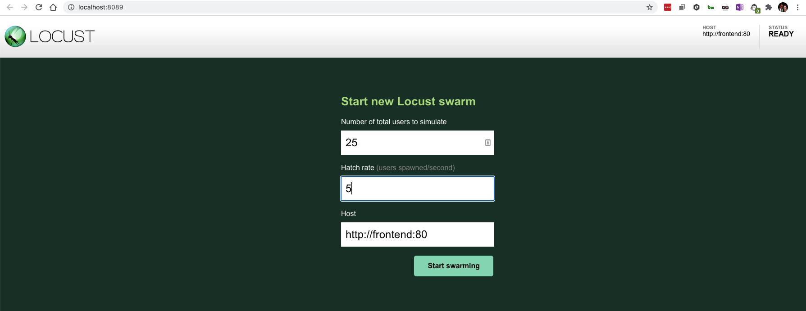
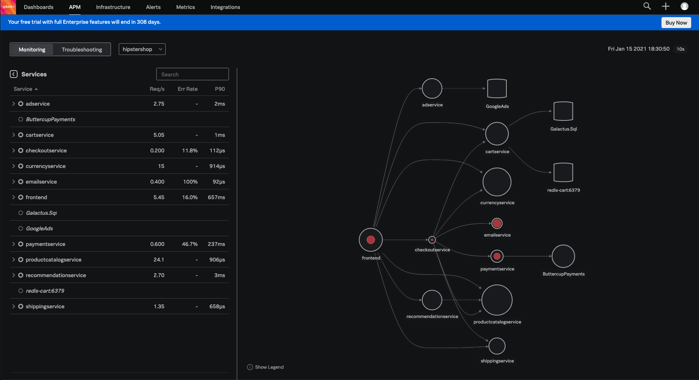
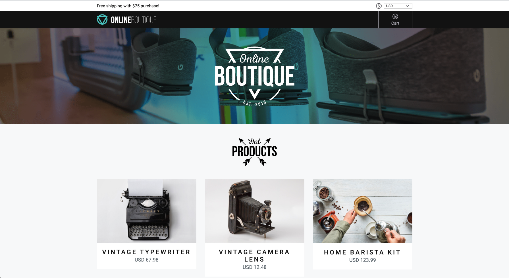

# Microservices Demo

This is a fork of the Google Microservices Demo repo that has been instrumented with OpenTelemetry (except for the Go-based microservices).

The source code for this application is in this repo: https://github.com/bxtp4p/microservices-demo-splunk. It's a private repo so **send me your github handle** and I'll add you to the repo so you can clone it.

## Requirements

* [Skaffold](https://skaffold.dev/docs/install/)
* A Docker Hub account (to push your container images to)
* Kubernetes 
* SignalFx agent and OpenTelemetry Collector deployed. See instructions [here](../../deployments/k8s/sfx-agent-with-opentelemetry-collector/README.md).

## Building and Deploying the app

Set up some environment variables:

```
export DOCKER_ID=[your docker id]
```

Make sure you are on the `otel-refactoring` branch of the app's repo.

```
git checkout otel-refactoring
```

Deploy the application with Skaffold:

skaffold run -d=docker.io/${DOCKER_ID}

Make sure the app pods are running:

```
kubectl get pod
```

Keep repeating the above until your pods are running. 

If you decide to change the code to this application, you can just rerun the skaffold command above to rebuild and push your images, and redeploy to your cluster.

## Generating Traffic

Traffic is generated via [Locust](https://locust.io/). The load generator is deployed as a Kubernetes service. To access:

```
kubectl port-forward service/loadgenerator 8089:8089
```

Then open up your browser to http://localhost:8089 and configure the number of users and hatch rate:




After a few moments, you should see the `hipstershop` application appear in your APM dashboard:



## Accessing the Hipstershop website

```
kubectl port-forward service/frontend-external 8000:80
```

The website is accessible at http://localhost:8000

